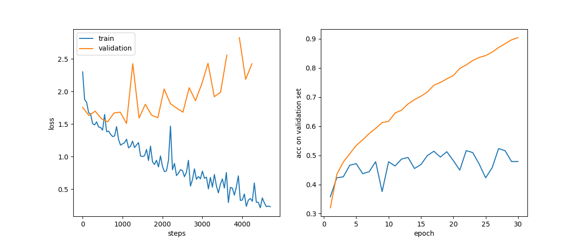

# Prerequisite
- Prepare the code
  
`git clone https://github.com/lsjlsj35/NNDL_homework1-numpify-neural-network.git; cd NNDL_homework1-numpify-neural-network`
- Prepare dataset
  
`wget https://www.cs.toronto.edu/~kriz/cifar-10-python.tar.gz`

`tar -czvf cifar-10-python.tar.gz`

## What's data like?
Run `python data.py`

train\:val\:test=40000\:10000\:10000

Image shape: \[32, 32, 3\]

Label: 0-9

## Code
- `data.py`: to load data from files; normalization policy; dataloader.
- `model.py`: **NNClassifier** (namely the trainer); **MLP model and CNN model**; **SimpleBatchGD** (with optimizer)
- `module.py`: all the modules that are necessary to form a model; loss functions
- `train.py`: training script, the entrance for training. It first loads and normalizes data via `data.py`, then trains the MLP model by NNClassifier defined in `model.py`. Training config and model config can be set with variables named CONFIG and MODEL_CONFIG respectively.

# Training
Run `python train.py` to start training with Numpy. The script automatically performs a *grid search* over the **learning rate** 1.0,0.2,0.05, **learning rate decay** 0.99,0.95, and **batch size** 256,1024.

## Result
If the code runs properly, you will get a set of result images containing the following:

